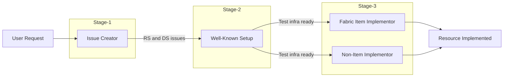

# AI-Assisted Development Infrastructure

This document describes the AI automation infrastructure used in the Terraform Provider for Microsoft Fabric. The system uses **GitHub Copilot agents, instructions, and skills** to automate the end-to-end implementation of Terraform resources — from creating GitHub issues to generating fully tested, documented code.

---

## Table of Contents

- [Architecture Overview](#architecture-overview)
- [Pipeline Flow](#pipeline-flow)
- [Agents](#agents)
  - [Issue Creator](#issue-creator-agent)
  - [Well-Known Setup](#well-known-setup-agent)
  - [Fabric Item Implementor](#fabric-item-implementor-agent)
  - [Non-Item Implementor](#non-item-implementor-agent)
- [Instructions](#instructions)
  - [Coding Standards](#coding-standards)
  - [Fabric Item Patterns](#fabric-item-patterns)
  - [Fabric Item Core](#fabric-item-core)
  - [Fake Handler Patterns](#fake-handler-patterns)
  - [Non-Item Patterns](#non-item-patterns)
  - [Schema and Model Patterns](#schema-and-model-patterns)
  - [Testing Patterns](#testing-patterns)
- [Skills](#skills)
  - [SDK Contract Navigator](#sdk-contract-navigator)
  - [Issue Composer](#issue-composer)
  - [Itemgen Command Builder](#itemgen-command-builder)
  - [Schema Model Generator](#schema-model-generator)
  - [Well-Known Analyzer](#well-known-analyzer)
- [Resource Classification](#resource-classification)
- [Global Context](#global-context)
- [How It All Connects](#how-it-all-connects)

---

## Architecture Overview

The AI infrastructure is organized into three layers, each serving a distinct purpose:

```mermaid
graph TD
    subgraph Agents
        A1[issue-creator - Stage 1]
        A2[wellknown-setup - Stage 2]
        A3[fabric-item-implementor - Stage 3A]
        A4[non-item-implementor - Stage 3B]
    end

    subgraph Skills
        S1[sdk-contract-navigator]
        S2[issue-composer]
        S3[itemgen-command-builder]
        S4[schema-model-generator]
        S5[wellknown-analyzer]
    end

    subgraph Instructions
        I1[coding-standards]
        I2[fabric-item-patterns]
        I3[fabricitem-core]
        I4[fake-handler-patterns]
        I5[non-item-patterns]
        I6[schema-model-patterns]
        I7[testing-patterns]
    end

    A1 -->|invokes| S1
    A1 -->|invokes| S2
    A2 -->|invokes| S5
    A3 -->|invokes| S1
    A3 -->|invokes| S3
    A3 -->|invokes| S4
    A4 -->|invokes| S1

    A3 -.->|auto-loaded| I1
    A3 -.->|auto-loaded| I2
    A3 -.->|auto-loaded| I4
    A3 -.->|auto-loaded| I6
    A3 -.->|auto-loaded| I7
    A4 -.->|auto-loaded| I1
    A4 -.->|auto-loaded| I5
    A4 -.->|auto-loaded| I6
    A4 -.->|auto-loaded| I7
```



**Layer 1 — Agents** define high-level workflows. They are invoked by users in Copilot Chat via `@agent-name` and coordinate multiple steps to accomplish a goal.

**Layer 2 — Skills** are reusable procedures that agents invoke via `#skill:<name>`. Each skill performs a focused task (e.g., navigating SDK source, composing an issue, generating schema code).

**Layer 3 — Instructions** are contextual knowledge files that Copilot automatically loads when editing files matching their `applyTo` glob pattern. They provide coding patterns, type mappings, and conventions without the user needing to reference them explicitly.

Additionally, `copilot-instructions.md` serves as the **global context** — always available to Copilot regardless of which file is being edited.

---

## Pipeline Flow

The agents form a **3-stage pipeline** that transforms a plain-language resource request into a fully implemented Terraform resource:



**Stage 1 — Issue Creation:** The Issue Creator agent validates that the Go SDK supports the requested resource, classifies it (Fabric Item or Non-Item), determines the archetype or pattern, and creates properly-formatted GitHub issues with all the details downstream agents need.

**Stage 2 — Test Infrastructure:** The Well-Known Setup agent ensures acceptance test fixtures exist. It checks and updates `tools/scripts/Set-WellKnown.ps1` (the PowerShell script that creates pre-requisite Fabric resources) and `internal/testhelp/wellknown.go` (the Go struct that test code uses to access fixture data).

**Stage 3 — Implementation:** The appropriate Implementor agent reads the GitHub issue, performs SDK analysis, generates all source files, registers the resource in the provider, creates examples, runs linters and tests, and verifies quality.

---

## Agents

Agents live in `.github/agents/` and define multi-step workflows. Each agent has a clear scope, input/output contract, and a numbered sequence of steps.

### Issue Creator Agent

**File:** `agents/issue-creator.agent.md`

**Invocation:** `@issue-creator`

**Purpose:** Transforms a plain-language resource request into well-structured GitHub issues that contain all the information downstream agents need.

**Workflow:**

1. **Parse the request** — Extract item name, snake-case name, package name, and intent (new vs enhancement)
2. **Validate SDK support** — Invoke `#skill:sdk-contract-navigator` to check if `fabric-sdk-go` has the required client, DTOs, and methods. If not supported, stop and direct the user to file an SDK issue
3. **Detect new vs increment** — Check if `internal/services/<package>/` already exists
4. **Classify the resource** — Determine if it's a Fabric Item (with archetype) or Non-Item (with pattern A–H)
5. **Collect milestone** — Ask the user which milestone to assign, resolve name to GitHub milestone ID
6. **Create issues** — Invoke `#skill:issue-composer` to format the issue body, then use GitHub MCP to create paired `[RS]` + `[DS]` issues (or `[FEAT]` for enhancements)
7. **Report output** — Provide issue URLs and next steps

**Key rules:**
- Never creates issues without SDK validation
- Always creates paired `[RS]` and `[DS]` issues for new resources
- Includes resource classification in the issue so downstream agents can route correctly
- API documentation URLs must never contain `en-us` locale segments

---

### Well-Known Setup Agent

**File:** `agents/wellknown-setup.agent.md`

**Invocation:** `@wellknown-setup`

**Purpose:** Configures the test infrastructure that acceptance tests depend on. Acceptance tests run against real Fabric APIs and need pre-existing resources (workspaces, items, connections, etc.) created by a PowerShell script.

**Workflow:**

1. **Read the issue** — Extract item name, resource category, and item type
2. **Check current state** — Invoke `#skill:wellknown-analyzer` to verify 4 locations in `Set-WellKnown.ps1`:
   - `Set-FabricItem` switch block (maps item type to REST API endpoint)
   - `$itemNaming` hashtable (2-5 character abbreviation)
   - Creation logic (simple array, dedicated payload block, or definition block)
   - `$wellKnown` output dictionary (writes item metadata for test consumption)
3. **Evaluate and act** — Either confirm everything is in place, or make the necessary additions
4. **Verify ordering** — Ensure creation order respects dependencies:
   - Azure infrastructure → Workspaces → Simple items → Dependent items → Definitions → Non-items → Sub-resources
5. **Report** — Summarize changes and confirm readiness for Stage 3

**Creation strategies:**
| Strategy | When | Example |
|----------|------|---------|
| A — Simple | Item needs only `displayName` + `description` | Lakehouse, Notebook, Environment |
| B — Payload | API requires `creationPayload` on create | KQL Database (needs parent Eventhouse ID) |
| C — Definition | API requires `definition` on create | Report (needs PBIR files), Semantic Model |
| D — Non-item | Custom setup for non-Fabric-item resources | Connections, Gateways, Domains |

---

### Fabric Item Implementor Agent

**File:** `agents/fabric-item-implementor.agent.md`

**Invocation:** `@fabric-item-implementor`

**Purpose:** Implements Fabric Item resources — the ~60% of resources that use the generic `internal/pkg/fabricitem/` abstraction. These resources follow standardized patterns and can be scaffolded with `itemgen`.

**New resource workflow (9 steps):**

| Step | Action | Details |
|------|--------|---------|
| 0 | Determine scope | Verify this is a Fabric Item (not Non-Item). Determine new (`[RS]`/`[DS]`) vs enhancement (`[FEAT]`) |
| 1 | SDK contract analysis | Invoke `#skill:sdk-contract-navigator` — get client factory, CRUD methods, DTOs, item type constant, archetype |
| 2 | Scaffold with itemgen | Invoke `#skill:itemgen-command-builder` — execute `go run tools/itemgen/main.go` with correct archetype and flags |
| 3.1 | Generate models | Invoke `#skill:schema-model-generator` — create `models.go` with property model structs, `tfsdk` tags, `set()` methods |
| 3.2 | Generate schema | Continue with `#skill:schema-model-generator` — create `schema_resource_*.go` and `schema_data_*.go` |
| 4.1 | Wire resource closures | Implement `propertiesSetter`, `itemGetter`, and `creationPayloadSetter` closures connecting resource operations to SDK calls |
| 4.2 | Wire data source closures | Implement closures for singular and plural data sources |
| 5 | Fix all TODO placeholders | **Critical step** — 7 categories of fixes across 6-8+ files (base.go, models.go, schema, resource, data sources, fakes, tests) |
| 6 | Register in provider | Add import, resource constructor, and data source constructors to `internal/provider/provider.go` |
| 7 | Generate examples | Create HCL examples in `examples/resources/` and `examples/data-sources/` |
| 8 | Lint, docs, tests | Run `task docs`, `task lint`, `task testunit` — fix any failures |
| 9 | Quality verification | Final checklist: coding standards, type mappings, provider registration, no remaining TODOs |

**Enhancement workflow (4 steps):**

| Step | Action |
|------|--------|
| E1 | SDK diff analysis — compare current SDK DTOs against existing `models.go` to identify new/changed fields |
| E2 | Apply model and schema changes — add new fields, `set()` mappings, sub-model structs |
| E3 | Update closures, fakes, and tests — populate new Properties fields in fakes, add test assertions |
| E4 | Verify — run docs, lint, tests; confirm no regressions |

**Post-itemgen fix guide (Step 5 detail):**

| Fix | File | What to Fix |
|-----|------|-------------|
| 1 | `base.go` | DocsURL, IsPreview, IsSPNSupported, definition paths |
| 2 | `models.go` | Stub structs → real SDK fields, `set()` body |
| 3 | `schema_*.go` | `"TODO"` keys → real attribute names, types, descriptions |
| 4 | `resource_*.go` | Boolean flags, `creationPayloadSetter` |
| 5 | `data_*.go` | Align `set()` calls with Fix 2 changes |
| 6 | `fakes/fabric_*.go` | Populate `Properties` with test data |
| 7 | `*_test.go` | Add `TestCheckResourceAttrSet` assertions |

---

### Non-Item Implementor Agent

**File:** `agents/non-item-implementor.agent.md`

**Invocation:** `@non-item-implementor`

**Purpose:** Implements Non-Item resources — the ~40% of resources that require bespoke CRUD implementations. These resources do not use `itemgen` or `fabricitem` generics.

**Key differences from Fabric Item Implementor:**
- **No scaffolding** — files are created manually, not via `itemgen`
- **Superschema** — single `schema.go` file using the `superschema` library (not separate `schema_resource_*.go` / `schema_data_*.go`)
- **Direct CRUD** — implements `Create`, `Read`, `Update`, `Delete` methods directly on a resource struct (no closures)
- **Pattern-based** — 8 implementation patterns (A–H) each with a distinct canonical reference

**Implementation patterns:**

| Pattern | Type | Canonical Reference | Key Characteristics |
|---------|------|---------------------|---------------------|
| **A** | Workspace policy singleton | `workspacencp/`, `workspaceocr/` | No entity ID, delete resets to default, uses `WorkspacesClient` |
| **B** | Workspace settings | `sparkwssettings/`, `sparkenvsettings/` | Dedicated Spark client, `ConfigValidators`, no ImportState |
| **C** | Role assignment | `workspacera/`, `gatewayra/` | Composite ID (`parentID/assignmentID`), parent-scoped, role updatable |
| **D** | Batch assignment | `domainra/`, `domainwa/` | Immutable set, no update operation, `SetNestedAttribute`, all forces replace |
| **E** | Standalone entity | `workspace/`, `gateway/`, `domain/` | Standard CRUD, may be polymorphic (gateway) or tenant-scoped (domain) |
| **F** | Item-scoped | `shortcut/`, `itemjobscheduler/` | 3+ path parameters, workspace_id + item_id scoping, inline fakes |
| **G** | Tenant-level | `tenantsetting/`, `tags/` | Admin API, name-based identity, custom delete behavior |
| **H** | Connection | `connection/` | Dual client, write-only secrets, KV references, `ModifyPlan`, generic type params |

**New resource workflow (10 steps):**

| Step | Action |
|------|--------|
| 0 | Determine scope — verify Non-Item, classify pattern (A–H) |
| 1 | SDK contract analysis |
| 2 | Create file structure following canonical reference for the pattern |
| 3.1 | Design models — may use generic type parameters for resource/data source variants |
| 3.2 | Implement superschema — single `schema.go` with `itemSchema(ctx, isList)` |
| 4.1 | Implement resource CRUD — direct methods, `utils.GetDiagsFromError` for errors |
| 4.2 | Implement data sources |
| 5 | Create fakes and tests — centralized or inline depending on API shape |
| 6 | Complete base constants in `base.go` |
| 7–10 | Register, examples, lint/docs/tests, quality verification |

---

## Instructions

Instructions live in `.github/instructions/` and are **automatically loaded** by Copilot when editing files matching their `applyTo` glob. They provide contextual coding patterns without requiring explicit reference.

### Coding Standards

**File:** `instructions/coding-standards.instructions.md`
**Scope:** `internal/**/*.go`

Enforces project-wide Go conventions:
- **Copyright header** — every `.go` file must have `// Copyright Microsoft Corporation 2026` and `// SPDX-License-Identifier: MPL-2.0`
- **SDK import aliases** — `fab` + package name (e.g., `fabcore`, `fablakehouse`, `fabfake`)
- **No `en-us` in URLs** — Microsoft docs links must omit locale
- **`MarkdownDescription` only** — never use `Description` in schema attributes (lint fails)
- **Error constants** — use `common.Err*` from `internal/common/errors.go`
- **Constructor naming** — `NewResource<Type>`, `NewDataSource<Type>`, `NewDataSource<Types>`

### Fabric Item Patterns

**File:** `instructions/fabric-item-patterns.instructions.md`
**Scope:** `internal/services/**/*.go`

Defines the 6 Fabric Item archetypes and their implementation patterns:

| Archetype | Definition | Properties | Config | Example |
|-----------|:----------:|:----------:|:------:|---------|
| `basic` | ✗ | ✗ | ✗ | KQL Dashboard, ML Model |
| `definition` | ✓ | ✗ | ✗ | Data Pipeline, Activator |
| `properties` | ✗ | ✓ | ✗ | Environment |
| `definition-properties` | ✓ | ✓ | ✗ | Spark Job Definition |
| `config-properties` | ✗ | ✓ | ✓ | Warehouse |
| `config-definition-properties` | ✓ | ✓ | ✓ | Lakehouse, Eventhouse |

Also documents:
- Generic type constructors (`fabricitem.NewResource*`)
- Closure patterns for `propertiesSetter`, `itemGetter`, `creationPayloadSetter`, `itemListGetter`
- Post-itemgen fix guide with 7 numbered fixes
- `set()` signature conventions (value vs pointer)
- `ctx` parameter requirement when schema uses `supertypes`

### Fabric Item Core

**File:** `instructions/fabricitem-core.instructions.md`
**Scope:** `internal/pkg/fabricitem/**`

Documents the generic abstraction layer that ~60% of resources compose with. **This package should only be modified for capabilities that apply to ALL Fabric Items** — item-specific logic belongs in service packages.

Key content:
- **Type hierarchy** — embedding relationships between resource structs (e.g., `ResourceFabricItemConfigDefinitionProperties` embeds `ResourceFabricItemDefinition`, NOT `ResourceFabricItem`)
- **Closure signatures** — exact type parameters for `PropertiesSetter`, `ItemGetter`, `CreationPayloadSetter`, `ItemListGetter`
- **`FabricItemProperties[T]`** — uses reflection (not interfaces) via `Set(from any)` to extract common fields. If SDK structs name fields differently, `Set()` silently returns `nil`
- **Retry logic** — `CreateItem` and `UpdateItem` retry indefinitely on `ItemDisplayNameNotAvailableYet` errors (2-minute intervals)
- **Schema generation** — how base attributes compose with archetype-specific additions

### Fake Handler Patterns

**File:** `instructions/fake-handler-patterns.instructions.md`
**Scope:** `internal/testhelp/fakes/**`

Documents how to create mock SDK servers for unit tests:

- **Operations struct** — implements typed handler interfaces (`simpleIDOperations`, `parentIDOperations`, `definitionOperations`)
- **Handler construction** — `newTypedHandler` (default converter) vs `newTypedHandlerWithConverter` (custom converter for entities with `Properties`)
- **Configure variants** — 6 functions matching different API shapes (sync/LRO create, with/without parent ID, with/without update)
- **Sub-operations** — decision tree for wiring fakes for non-CRUD SDK methods
- **Override pattern** — exported functions for custom list/filter logic
- **`typedHandler` API** — `Contains`, `Get`, `Upsert`, `Delete`, `Elements` methods
- **Polymorphic resources** — multiple type registrations with shared configure functions
- **Inline fakes** — for resources with non-standard path parameters (3+), using package-level map stores

### Non-Item Patterns

**File:** `instructions/non-item-patterns.instructions.md`
**Scope:** `internal/services/**/*.go`

Documents patterns for the ~40% of resources that don't use the `fabricitem` abstraction:

- **File structure** — single `schema.go` with `superschema` instead of separate schema files; models may split across `models_resource_*.go` and `models_data_*.go`
- **Resource struct** — holds `pConfigData`, typed SDK `client`, and `TypeInfo`; `Configure` method creates client from fabric client
- **CRUD template** — plan extraction, timeout handling, request builder, SDK call, response mapping, state set
- **Read not-found** — use `utils.IsErrNotFound()` → `resp.State.RemoveResource(ctx)`
- **Model pattern** — may use generic type parameters to share a base model between resource and data source
- **8 canonical references** — one for each implementation pattern (A–H)

### Schema and Model Patterns

**File:** `instructions/schema-model-patterns.instructions.md`
**Scope:** `internal/services/**/schema_*.go`, `internal/services/**/models.go`

The most reference-heavy instruction file, providing type mapping tables used by both human developers and AI agents:

**Schema approaches:**
1. Fabric Items — separate `schema_resource_*.go` / `schema_data_*.go` files
2. Non-Items — single `schema.go` using `superschema` with `Common`, `Resource`, `DataSource` variants

**SDK Type → Schema Mapping:**

| SDK Type | Schema Type |
|----------|-------------|
| `*string` | `schema.StringAttribute` |
| `*bool` | `schema.BoolAttribute` |
| `*int32` / `*int64` | `schema.Int32Attribute` / `schema.Int64Attribute` |
| UUID (`*string`) | `schema.StringAttribute{CustomType: customtypes.UUIDType{}}` |
| Nested struct | `schema.SingleNestedAttribute{CustomType: supertypes.NewSingleNestedObjectTypeOf[<model>](ctx)}` |
| Slice of structs | `schema.ListNestedAttribute` or `schema.SetNestedAttribute` with `supertypes` |
| Enum types | `schema.StringAttribute` (string representation) |

**SDK Type → Model Type Mapping:**

| SDK Type | Model Type | Setter Pattern |
|----------|------------|----------------|
| `*string` | `types.String` | `types.StringPointerValue(from.Field)` |
| `*bool` | `types.Bool` | `types.BoolPointerValue(from.Field)` |
| `*int32` | `types.Int64` | `types.Int64Value(int64(*from.Field))` |
| UUID | `customtypes.UUID` | `customtypes.NewUUIDPointerValue(from.ID)` |
| Enum | `types.String` | `types.StringPointerValue((*string)(from.Field))` |
| Nested | `supertypes.SingleNestedObjectValueOf[M]` | Create sub-model, call `.set()`, wrap with `.Set(ctx, ...)` |

Also covers:
- Attribute behaviors (`Required`, `Optional`, `Computed`, `RequiresReplace`)
- Null vs Unknown — `Value<Type>Pointer()` gotcha with `Computed: true`
- Plan modifiers and validators
- `set()` method patterns (top-level with `ctx` + `diag.Diagnostics` vs leaf without)

### Testing Patterns

**File:** `instructions/testing-patterns.instructions.md`
**Scope:** `internal/**/*_test.go`

Defines testing conventions and patterns:

**Test naming:** `TestUnit_<TypeName>Resource_CRUD`, `TestUnit_<TypeName>Resource_Attributes`, `TestUnit_<TypeName>DataSource`

**Test types:**

| Suffix | Purpose |
|--------|---------|
| `_Attributes` | Schema constraint validation (missing required, invalid UUIDs, conflicts) |
| `_CRUD` | Full lifecycle (Create+Read, Update+Read, Delete) |
| `_ImportState` | Import validation (invalid format, invalid segments, successful import) |
| `DataSource` | Read scenarios (by-id, by-name, not-found) |

**Rules:**
- **Black-box testing** — test packages must use `_test` suffix
- **Parallel** — use `resource.ParallelTest` unless ordered dependencies exist
- **Coverage** — target >80%
- **Never `go test`** — always use `task testunit` / `task testacc` (sets required env vars like `FABRIC_PREVIEW=true`)
- **Fake decision tree** — centralized fakes for standard ID patterns, inline fakes for 3+ path params
- **Responder types** — `azfake.Responder` (sync), `azfake.PagerResponder` (list), `azfake.PollerResponder` (LRO)
- **Stateful fakes** — use state struct for CRUD tests where Get must reflect Updates
- **Error simulation** — `fabfake.SetResponseError` for 404/conflict responses

---

## Skills

Skills live in `.github/skills/<name>/SKILL.md` and contain step-by-step procedures invoked by agents via `#skill:<name>`.

### SDK Contract Navigator

**File:** `skills/sdk-contract-navigator/SKILL.md`

**Purpose:** Navigates the `fabric-sdk-go` source code to extract the complete SDK contract for a given resource.

**How it works:**
1. Reads `go.mod` to get the exact SDK version (never hardcoded)
2. Ensures the SDK is in the local Go module cache via `go mod download`
3. Browses SDK files using `read_file` and PowerShell `Select-String` (preferred over GitHub MCP for speed)
4. For **Fabric Items**: locates the SDK package under `fabric/<package>/`, identifies client factory, CRUD methods, `Properties` DTO, `CreationPayload` DTO, item type constant, and determines archetype
5. For **Non-Items**: locates the client in `fabric/core/`, identifies bespoke CRUD methods, request/response DTOs

**Output:** Structured table with category, SDK version, package, import alias, client factory, methods, DTOs, and archetype.

### Issue Composer

**File:** `skills/issue-composer/SKILL.md`

**Purpose:** Composes properly-formatted GitHub issue bodies with all required sections, labels, and templates.

**Key behaviors:**
- Resolves milestone names to GitHub milestone IDs via the API
- Chooses correct template: `[RS]` → `tf/resource`, `[DS]` → `tf/data-source`, `[EPH]` → `tf/ephemeral`, `[FEAT]` → `feature`
- For Fabric Items: includes archetype, definition paths, SDK package (but NOT CRUD method signatures — those are implied by archetype)
- For Non-Items: includes full SDK contract with CRUD methods and implementation pattern letter (A–H)
- For complex DTOs (3+ nesting levels): generates a **DTO Nesting Depth Map** tree
- Includes HCL sample, acceptance criteria, and definition-of-done checklist

**Pattern classification decision tree for Non-Items:**
```
Workspace policy with no real entity ID?
├── Uses WorkspacesClient, delete=reset → Pattern A
├── Uses dedicated Spark client, ConfigValidators → Pattern B
Assignment of principals/items to a parent?
├── Single-item, updatable role, ImportState → Pattern C
├── Batch set, immutable, no Import → Pattern D
Scoped to a specific item with workspace_id + item_id?
└── Pattern F
Tenant-level admin with non-UUID identity or custom delete?
└── Pattern G
Write-only secrets, dual clients, KV references?
└── Pattern H
Otherwise → Pattern E (standalone entity)
```

### Itemgen Command Builder

**File:** `skills/itemgen-command-builder/SKILL.md`

**Purpose:** Builds the correct `go run tools/itemgen/main.go` command for scaffolding a new Fabric Item resource. **Only applies to Fabric Items — Non-Items do not use itemgen.**

**9 command flags:**

| Flag | How to Determine |
|------|-----------------|
| `-item-name` | Display name from Microsoft docs (e.g., "Data Pipeline") |
| `-items-name` | Plural form (e.g., "Data Pipelines") |
| `-item-type` | Archetype from SDK analysis |
| `-definition-path` | From issue's "Definition Paths" field |
| `-rename-allowed` | `true` unless SDK lacks Update method |
| `-is-preview` | Check API docs for "preview" badge |
| `-is-spn-supported` | Check API docs for SPN support |
| `-generate-fakes` | `true` unless `basic` or `definition` archetype |
| `-generate-examples` | Always `true` |

### Schema Model Generator

**File:** `skills/schema-model-generator/SKILL.md`

**Purpose:** Generates `models.go` and `schema_*.go` files from SDK DTOs with correct type mappings, `tfsdk` tags, and `set()` methods.

**Workflow:**
1. **Classify each SDK field** — read-only, create-time-only, updatable required/optional, optional with default
2. **Generate model struct fields** — map SDK types to TF model types with `tfsdk:"snake_case"` tags
3. **Generate model methods** — response `set()` (SDK→TF) and request builders (TF→SDK)
4. **Generate schema attributes** — map SDK types to schema types with correct behaviors, plan modifiers, and validators

If the issue contains a **DTO Nesting Depth Map**, uses it to determine number of sub-model structs, supertype field selections, and `set()` method boundaries.

### Well-Known Analyzer

**File:** `skills/wellknown-analyzer/SKILL.md`

**Purpose:** Analyzes what test infrastructure must be added so acceptance tests for a new resource have all required pre-requisites.

**Dependency analysis covers:**
- Fabric item dependencies (workspace, parent items, definitions, data population)
- Azure infrastructure (resource groups, storage accounts, VNets, data factories)
- Entra ID objects (service principals, groups, app registrations)
- External services (Azure DevOps, GitHub connections)

**Checks 4 locations in `Set-WellKnown.ps1`:**
1. `Set-FabricItem` switch block — item type → REST API endpoint mapping
2. `$itemNaming` hashtable — 2-5 character abbreviation
3. Creation logic — which strategy (A/B/C/D) to use
4. `$wellKnown` output — metadata written for test consumption

---

## Resource Classification

The provider manages two categories of resources with fundamentally different implementation approaches:

### Category A: Fabric Items (~60%)

Standard items managed in Fabric workspaces. They use the generic `internal/pkg/fabricitem/` abstraction, are scaffolded with `itemgen`, and follow one of 6 archetypes based on SDK capabilities (definition support, properties, creation payload).

**Examples:** Lakehouse, Eventhouse, Data Pipeline, SQL Database, KQL Database, Notebook, Semantic Model, Spark Job Definition, ML Experiment, ML Model, Environment, Warehouse, Report, Dataflow

### Category B: Non-Item Resources (~40%)

Specialized resources with bespoke CRUD logic using `superschema`. They implement `resource.Resource` directly with custom Create/Read/Update/Delete methods. Each belongs to one of 8 implementation patterns (A–H).

**Examples:** Connection, Shortcut, Gateway, Workspace, Domain, Workspace Role Assignment, Connection Role Assignment, Gateway Role Assignment, Workspace Git, Tenant Setting, Tags, Folder, Item Job Scheduler

---

## Global Context

**File:** `copilot-instructions.md`

This file is always loaded by Copilot regardless of which file is being edited. It provides:

- **Technology stack** — Go, HashiCorp Terraform Plugin Framework, Fabric SDK, Task runner
- **Project structure** — directory purposes for `internal/services/`, `internal/pkg/fabricitem/`, `internal/provider/`, etc.
- **Resource categories** — overview of Fabric Items vs Non-Items with canonical references
- **Common commands** — `task build`, `task tools`, `task testunit`, `task testacc`, `task lint`, `task docs`
- **Provider registration** — how to register new resources in `provider.go`
- **Documentation** — `MarkdownDescription`, `tfplugindocs`, example conventions
- **Coding conventions** — SDK aliases, HCL naming, error constants, black-box tests, parallelism, coverage target

---

## How It All Connects

When a developer says *"I need a Fabric Eventhouse resource"*, the system works as follows:

1. **`@issue-creator`** invokes `#skill:sdk-contract-navigator` → finds `fabric/eventhouse/` package, determines `config-definition-properties` archetype → invokes `#skill:issue-composer` → creates `[RS] fabric_eventhouse` and `[DS] fabric_eventhouse` GitHub issues

2. **`@wellknown-setup`** invokes `#skill:wellknown-analyzer` → confirms Eventhouse is already in the `$itemTypes` simple array → reports "already configured"

3. **`@fabric-item-implementor`** reads the issue → invokes `#skill:sdk-contract-navigator` (verify) → invokes `#skill:itemgen-command-builder` (scaffold) → invokes `#skill:schema-model-generator` (models + schema) → wires closures → fixes TODOs → registers in provider → creates examples → runs `task docs`, `task lint`, `task testunit`

Throughout Steps 2-3, Copilot automatically loads the relevant **instructions** based on which files are being edited:
- Editing `internal/services/eventhouse/*.go` → loads `coding-standards`, `fabric-item-patterns`
- Editing `internal/services/eventhouse/schema_*.go` → also loads `schema-model-patterns`
- Editing `internal/services/eventhouse/*_test.go` → loads `testing-patterns`
- Editing `internal/testhelp/fakes/fabric_eventhouse.go` → loads `fake-handler-patterns`
